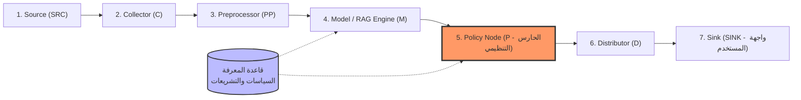

# 📘 دليل الهاكاثون الشامل والمعتمد: هاكاثون جاهزية الذكاء الاصطناعي ITU 🇸🇦
## ITU AI Readiness Hackathon — Kingdom of Saudi Arabia

> **الوثيقة المرجعية الرسمية والمواصفات القياسية للمشروع**  
> تشمل كافة الاشتراطات التنظيمية، معيار **ITU-T Y.3172**، أبعاد إطار **ITU AI Readiness 2.0**، قوالب التسليمات، كود عقدة السياسات، سيناريوهات التحكيم، ومصفوفة الثغرات.

---

## 1. التسليمات الرسمية للهاكاثون والجدول الزمني

```text
                             📦 التسليمات الرسمية للهاكاثون
                                           │
         ┌──────────────────────┬──────────┴────────────┬─────────────────────┐
         ▼                      ▼                       ▼                     ▼
  📄 التقرير التقني       🎬 فيديو العرض           💻 مستودع الكود         📚 قاعدة المعرفة
(Technical Report)     (7-Min Walkthrough)      (GitHub Repository)    (Knowledge Base & Links)
 ├─ 5 صفحات كحد أقصى    ├─ استعراض 3 سيناريوهات   ├─ كود الواجهة والـ API ├─ مراجع رسمية موثقة
 ├─ معمارية Y.3172      ├─ ترجمة نصية Subtitles   ├─ كود عقدة السياسات(P) ├─ تصدير JSON لـ AI-RE
 └─ مصفوفة الثغرات      └─ إثبات الـ RAG الحي     └─ خالٍ من مفاتيح API   └─ روابط مفتوحة وقانونية
```

### جدول تفاصيل وشروط التسليمات

| مخرج التسليم | الشروط الفنية الصارمة | معايير القبول والأدوات |
| :--- | :--- | :--- |
| **📄 التقرير التقني (5 صفحات)** | الالتزام الصارم بقالب الـ 5 صفحات، رسم معمارية ITU-T Y.3172، تحليل أبعاد تقرير الجاهزية ITU v2.0 ومصفوفة الثغرات. | LaTeX أو Word/Docs مصدّر كملف PDF عالي الجودة |
| **🎬 فيديو العرض (7 دقائق)** | استعراض واجهة النظام الحقيقية، اختبار السيناريوهات الـ 3 (طبيعي، فشل، جدلي)، وترجمة نصية واضحة (Subtitles). | OBS Studio / Win Game Bar + CapCut للترجمة |
| **💻 مستودع الكود (GitHub)** | مستودع عام منظم يحوي كود الواجهة، دوال Supabase/Edge Functions، وملف `README.md` تفصيلي خالٍ من مفاتيح API. | GitHub Public Repository مع ترخيص MIT / Apache 2.0 |
| **📚 قاعدة المعرفة (KB)** | ملفات Markdown/JSON تحوي نصوص المواد النظامية وروابطها الرسمية (15 إلى 40 مصدراً موثوقاً دون وثائق سرية). | Supabase pgvector + ITU AI-RE JSON Export Format |

### الجدول الزمني للهاكاثون:
* **الموعد النهائي لتسليم المشاريع:** الإثنين، 31 أغسطس 2026 — الساعة 23:59 بتوقيت السعودية.
* **إعلان الفرق المتأهلة:** الإثنين، 7 سبتمبر 2026.
* **اليوم النهائي والتحكيم الحضوري:** الإثنين، 14 سبتمبر 2026 (الرياض 📍).

### طبيعة النموذج المطلوب والعتاد (Hardware):
* **الهاردوير ليس إلزامياً إطلاقاً:** يسمح الهاكاثون بالهاردوير إذا كانت فكرتك تتطلبه، ولكن يمكن تنفيذ ومحاكاة أي حساسات أو أجهزة برمجياً بنسبة 100%.
* **شكل المخرج البرمجي:** يمكن أن يكون الحل تطبيق ويب، شات بوت ذكي، لوحة تحكم (Dashboard)، أداة محاكاة، أو بوابة وسيطة (Middleware).
* **النموذج الأولي التشغيلي (MVP):** المطلوب هو نموذج أولي وظيفي حقيقي يثبت استرجاع السياسات والتحليل الدقيق، وليس مجرد تصميم واجهات شكلية ثابتة.

---

## 2. معايير التقييم ولجنة التحكيم

تعتمد لجان التحكيم في تقييم المشاريع على المعايير التالية:
1. **فهم المشكلة وملاءمة المسار:** وضوح التحدي في السياق الوطني السعودي وقيمته المضافة.
2. **جودة قاعدة المعرفة والمصادر:** دقة وموثوقية اللوائح والسياسات المعتمدة وربطها بروابط مباشرة.
3. **التكامل مع معيار ITU-T Y.3172:** دقة تمثيل العقد السبع وخصوصاً دور عقدة السياسات ($P$).
4. **التوافق مع إطار ITU AI Readiness 2.0:** جودة ربط المشروع بالأبعاد والعوامل المناسبة وتقديم الأدلة.
5. **جودة السيناريوهات والتحليل التنظيمي:** اختبار الحالات الحدية، والاعتراف بنقص الأدلة، وتطبيق الـ Human-in-the-loop.
6. **اكتمال الحل والـ Demo التشغيلي:** عمل الواجهة واسترجاع الـ RAG بسلاسة ودون اختلاق أدلة.
7. **الشفافية والأمان:** الالتزام بنظام حماية البيانات الشخصية (PDPL)، واستخدام بيانات محاكاة معلنة، وخلو الكود من الأسرار.
8. **احترافية التقرير والعرض:** الالتزام الصارم بحدود الصفحات (5 صفحات) ووقت الفيديو (7 دقائق).

---

## 3. المفاهيم التنظيمية وتصنيفات التحليل الستة

### 3.1 قاعدة المعرفة (Knowledge Base)
مجموعة موثقة ومنظمة من السياسات والأنظمة واللوائح الرسمية، محوّلة إلى سجلات قابلة للبحث والاسترجاع، وتحتوي كل وثيقة على:
* العنوان الرسمي (`document_title`) والجهة المصدرة (`issuing_authority`).
* الرابط الحكومي المباشر الصالح (`source_url`).
* المادة أو القسم أو الصفحة المستشهد بها (`section_reference`).
* النص المقتطف بأمانة دون تحريف (`content`).
* أبعاد الجاهزية المرتبطة (`readiness_dimensions`) وحالة التحقق البشري (`is_verified`).

### 3.2 تصنيفات التحليل التنظيمي الستة (Policy Gap Classification)
يجب تصنيف مخرجات تحليل السيناريوهات بدقة إلى إحدى الحالات التالية:
1. **متوافق (COMPLIANT):** الممارسة مدعومة بنص نظامي صريح وتتوافق معه بالكامل.
2. **مخالفة (VIOLATION):** الممارسة تخالف نصاً نظامياً صريحاً ومعلناً (الإجراء: حظر التنفيذ وتنبيه المستخدم).
3. **غموض (AMBIGUITY):** يوجد تنظيم ولكن طريقة تطبيقه على الحالة التقنية المحددة غير واضحة.
4. **تعارض (CONFLICT):** وجود متطلبات تنظيمية متعددة يصعب الجمع بينها تقنياً.
5. **فجوة محتملة (POTENTIAL_GAP):** حالة تقنية مبتكرة لا يغطيها نص تنظيمي صريح بعد البحث الموثق.
6. **دليل غير كافٍ (INSUFFICIENT_EVIDENCE):** قاعدة المعرفة الحالية لا تتضمن ما يكفي للبت في المسألة (الإجراء: الامتناع عن الهلوسة والتوجيه لمراجعة مختص).

### 3.3 الرقابة البشرية والبيانات المحاكاة
* **الإنسان في الحلقة (Human-in-the-loop):** في الحالات عالية المخاطر أو القرارات المصيرية، يقتصر دور النظام على التوصية وتنبيه المراجع البشري مع اشتراط موافقته.
* **البيانات المحاكاة (Synthetic Data):** يُحظر استخدام بيانات شخصية أو طبية حقيقية؛ ويجب وضع تنبيه صريح في التطبيق والتقرير: *"بيانات محاكاة لأغراض الهاكاثون فقط"*.

---

## 4. المعمارية القياسية لخط الإنتاج (ITU-T Y.3172)

يجب توثيق تدفق البيانات في المشروع عبر العقد المنطقية السبع المحددة في توصية الاتحاد الدولي للاتصالات **ITU-T Y.3172**:



### تفصيل وتوصيف أدوار العقد السبع في المشروع:

| العقدة | الرمز | دورها في معيار ITU-T Y.3172 | تطبيقها في النظام |
| :--- | :--- | :--- | :--- |
| **Source** | **SRC** | مصدر البيانات الخام والمدخلات. | نصوص اللوائح السعودية، بيانات المريض، قراءات الأجهزة، والبيانات المحاكاة. |
| **Collector** | **C** | تجميع واستقبال البيانات. | واجهات برمجة التطبيقات (APIs) ونقاط استقبال بروتوكولات (HL7 FHIR / DICOM). |
| **Preprocessor** | **PP** | تنظيف وتنسيق وتجزئة البيانات. | إزالة المعرفات الشخصية (Anonymization وفق PDPL)، تقطيع النصوص وتوليد المتجهات (Embeddings). |
| **Model** | **M** | خوارزميات الاستدلال والتوليد (LLM). | النموذج اللغوي ومحرك الـ RAG لاسترجاع النصوص وصياغة الاستنتاجات والتوصيات. |
| **Policy Node** | **P** | **صمام الأمان التنظيمي وفاحص الامتثال.** | فحص مخرجات النموذج ومطابقتها مع لوائح وزارة الصحة وسدايا وSFDA، وتطبيق الحظر أو التحذير أو طلب موافقة استشاري. |
| **Distributor** | **D** | توجيه وتنسيق القرارات والنتائج. | تنسيق النتيجة النهائية، وتضمين المراجع والروابط الحكومية وبطاقات التنبيه وسجلات الحوكمة (Audit Logs). |
| **Sink** | **SINK** | نقطة التطبيق النهائي واتخاذ القرار. | شاشة متخذ القرار (طبيب، استشاري، فني) أو أوامر التحكم بالأجهزة الطرفية (CT Scanner / Injector). |

---

## 5. عوامل وأبعاد جاهزية الذكاء الاصطناعي (ITU AI Readiness 2.0)

يجب ربط المشروع بإطار جاهزية الذكاء الاصطناعي (*ITU AI Readiness Report v2.0*) عبر اختيار **3 إلى 6 أبعاد وثيقة الصلة** بفكرتك وتقديم الأدلة عليها:

### العوامل الأساسية الستة (6 Key Factors):
1. **البيانات المفتوحة (Data):** توفر وجودة اللوائح والمصادر الرسمية وسجلات قاعدة المعرفة.
2. **البحث (Research):** التعاون بين خبراء المجال الموضوعي ومطوري الذكاء الاصطناعي للتحقق من المنهجية.
3. **دعم النشر (Deployment Support):** جاهزية البنية البرمجية والسحابية للتشغيل الموثوق.
4. **المعايير (Standards):** الامتثال للمعايير القياسية الدولية (مثل ITU-T Y.3172) والأنظمة الوطنية.
5. **المصادر المفتوحة (Open Source):** مشاركة الكود النظيف وتوثيق المعمارية عبر مستودعات عامة ومنظمة.
6. **بيئة الاختبار (Sandbox):** تجربة النظام والتحقق من السيناريوهات في بيئة آمنة محاكية للواقع.

### الأبعاد الثلاثة عشر (13 Dimensions):
1. **سوق البيانات والنماذج (Data & Model Marketplaces)**
2. **سوق المحتوى المولّد (Content Creation Marketplaces)**
3. **سياسات وبنية البيانات التحتية (Data & AI Infrastructure Policies)**
4. **بيئات الاختبار التنظيمية (Regulatory Sandboxes)**
5. **التمويل والحوافز (Financial Incentives)**
6. **مواءمة الاستراتيجيات الوطنية (National Strategy Alignment)**
7. **الشراكات والتعاون الإقليمي (Regional Cooperation & Context)**
8. **أطر المعايير والشهادات (Standards & Certification Frameworks)**
9. **التعليم وبناء القدرات (Education & Capacity Building)**
10. **الذكاء الاصطناعي المسؤول والسياسات (Responsible AI & Policy)**
11. **حوكمة البيانات والخصوصية (Data Governance & Privacy)**
12. **تفاعل الإنسان والآلة والواجهات (Human-AI Interaction & UX)**
13. **التعاون البشري والرقابة (Human Collaboration & Oversight)**

### قالب توثيق أبعاد الجاهزية:
| البُعد المختار | سبب الارتباط بحالة الاستخدام | الدليل والممارسة في النظام |
| :--- | :--- | :--- |
| **حوكمة البيانات والخصوصية** | حماية بيانات المرضى/المستخدمين والامتثال لنظام PDPL | منع تخزين البيانات الشخصية الحساسة، وتطبيق التشفير والمحاكاة |
| **التعاون البشري والرقابة** | ضمان سلامة القرارات في الحالات الطبية الحرجة | إيقاف القرار الآلي في السيناريو الجدلي واشتراط موافقة الاستشاري |
| **الذكاء الاصطناعي المسؤول** | منع الهلوسة والتحيز وتوثيق المراجع اللحظية | إلزام النموذج بالاستناد لقاعدة المعرفة وإبراز الروابط الرسمية |

---

## 6. موجهات البحث العميق المعتمدة للمسارات الأربعة (Deep Research Prompts)

### 🎓 1. موجه مسار التعليم (Education Deep Research Prompt)
```text
Act as a Senior AI Governance and Telecommunications Policy Expert specializing in ITU-T standards and Saudi Arabian educational regulations.
Perform a deep research on all publicly accessible Saudi national policies, ethical frameworks, and digital regulations governing AI in education:
1. SDAIA AI Ethics Principles (Fairness, Transparency, Accountability, Privacy, Human Oversight).
2. Saudi PDPL (M/19) regarding minor/student consent and biometric handling.
3. Saudi MoE digital learning directives and student data handling policies.
4. UNESCO & ITU Competency Frameworks and Ethical Guidelines for AI in School Curricula.
```

### 🏥 2. موجه مسار الصحة (Health & Radiology Deep Research Prompt)
```text
Act as a Medical Informatics and Regulatory Compliance Specialist focusing on Saudi healthcare AI governance and ITU-T Y.3172 standards.
Conduct an exhaustive deep research on Saudi and international health AI regulations, clinical decision support rules, and patient data protection:
1. Saudi Ministry of Health (MoH) Clinical Practice Guidelines, Radiology Protocols, and Contrast Agent Administration safety limits (e.g., GFR thresholds, radiation dosage kVp/mAs).
2. Saudi Food and Drug Authority (SFDA) Medical Software and AI-as-a-Medical-Device (SaMD) regulatory approval guidelines.
3. Saudi PDPL Health Data Regulations (handling sensitive patient records, automated diagnostic liability, and physician oversight).
4. WHO & ITU Global Standards for Ethics and Governance of AI in Health.
```

### 🌱 3. موجه مسار الزراعة (Agriculture Deep Research Prompt)
```text
Act as an Agri-Tech Regulatory and Environmental Policy Analyst specializing in ITU AI Readiness standards.
Perform a deep research on official Saudi policies, agricultural datasets, and resource optimization regulations:
1. Ministry of Environment, Water and Agriculture (MEWA) regulations on water usage quotas, crop distribution, and food waste reduction.
2. Saudi Vision 2030 Food Security Strategy and open data initiatives for wholesale agricultural markets.
3. SDAIA Open Government Data standards applied to agricultural IoT sensor deployments.
4. FAO / ITU Digital Agriculture Transformation Frameworks and environmental AI ethics.
```

### 💰 4. موجه مسار المالية (Finance Deep Research Prompt)
```text
Act as a FinTech Regulatory and AI Compliance Consultant specializing in Saudi financial regulations and ITU-T Y.3172.
Perform a deep research on Saudi banking, fintech, and algorithmic compliance frameworks:
1. Saudi Central Bank (SAMA) Regulatory Sandbox Framework and Open Banking Guidelines.
2. Zakat, Tax and Customs Authority (ZATCA) electronic invoicing (FATOORA) automated verification rules.
3. Saudi Capital Market Authority (CMA) directives on Robo-Advisory and automated algorithmic trading risk management.
4. Basel Committee / ITU Digital Financial Inclusion & Algorithmic Accountability Standards.
```

---

## 7. مصفوفة الثغرات التنظيمية والتقنية الشاملة (Policy Gaps Matrix)

| المسار | الممارسة التقنية الحالية (Tech Reality) | الإطار النظامي المطبق (Saudi Policy / Law) | الفجوة التنظيمية المكتشفة (Identified Policy Gap) | التوصية التصحيحية من النظام (System Recommendation) |
| :--- | :--- | :--- | :--- | :--- |
| **الصحة** | اقتراح بروتوكولات الأشعة وجرعات الصبغة آلياً عبر خوارزميات الذكاء الاصطناعي. | معايير SFDA للأجهزة الطبية والمسؤولية المهنية لوزارة الصحة. | عدم وجود نص تشريعي صريح يحدد المسؤولية القانونية عند حدوث خطأ ناتج عن توصية خوارزمية ذكاء اصطناعي اعتمدها فني مرهق. | عزل الذكاء الاصطناعي كـ "نظام دعم قرار مشروط" وتطبيق قفل عتادي يمنع الحقن التلقائي دون موافقة استشاري مسجل. |
| **التعليم** | استخدام روبوتات الذكاء الاصطناعي التوليدي لشرح الدروس وتحليل مستوى الطلاب. | نظام PDPL المادة 16 (موافقة ولي الأمر للقُصّر) وأخلاقيات سدايا. | غياب آلية API وطنية موحدة للتحقق من سن الطالب وموافقة ولي الأمر قبل بدء جلسات الذكاء الاصطناعي التفاعلية. | فرض "عقدة سياسات" تشترط توثيق هوية ولي الأمر عبر النفاذ الوطني قبل تفعيل الميزات التوليدية المتقدمة. |
| **الزراعة** | ربط حساسات IoT وتوصيات الري والتسميد الذكية بالمزارع الخاصة. | لوائح وزارة البيئة والمياه والزراعة (MEWA) لحصص المياه الجوفية. | غياب الربط اللحظي بين أنظمة الذكاء الاصطناعي الخاصة بالمزارعين وحصص استهلاك المياه الرسمية المرخصة لكل بئر. | إلزام بوابات الـ Edge AI بمطابقة جداول الري اليومية تلقائياً مع السقف الأعلى المسموح به في رخصة البئر الصادرة من MEWA. |
| **المالية** | اتخاذ قرارات تصنيف الائتمان ومنح القروض للمنشآت الصغيرة آلياً. | تعليمات البنك المركزي السعودي (SAMA) لحماية العملاء والعدالة الائتمانية. | صعوبة تفسير نماذج "الصندوق الأسود" (Black-Box AI) وتقديم مبررات مقبولة نظاماً للعميل في حال رفض التمويل. | إدراج طبقة Explainable AI (XAI) تلزم النموذج باستخراج بنود الرفض المحددة وتوثيقها وفق مصفوفة معايير ساما. |

---

## 8. السيناريوهات التقييمية الثلاثة الإلزامية (Evaluation Scenarios)

```text
                        🎭 مسار اختبار السيناريوهات التقييمية الثلاثة
                                           │
         ┌─────────────────────────────────┼────────────────────────────────┐
         ▼                                 ▼                                ▼
【السيناريو 1: التشغيل الطبيعي】       【السيناريو 2: الفشل التشغيلي】      【السيناريو 3: الانتهاك الجدلي】
 - استعلام نظامي ومكتمل             - بيانات مفقودة أو قراءة شاذة        - محاولة استغلال بيانات أو إعلان
 - استرجاع الأدلة من الـ RAG         - التدخل بإيقاف المخرج آلياً         - تدخل حاسم لعقدة السياسات (P)
 - إجازة المخرج وتوثيق المرجع       - طلب استكمال البيانات والتصحيح       - حظر الطلب وإصدار تقرير انتهاك
```

### 1. السيناريو الأول: التدفق الطبيعي الناجح (Baseline / Compliant Path)
* **الحدث:** إدخال استعلام أو بيانات صحيحة ومكتملة (مثل: فحص أشعة روتيني لمريض وظائف كلاه سليمة).
* **سلوك النظام:**
  1. تمر البيانات عبر مسار $SRC \rightarrow C \rightarrow PP$.
  2. يسترجع النموذج $M$ نصوص البروتوكول الطبي من قاعدة معارف الـ RAG.
  3. تفحص عقدة السياسات $P$ المخرج وتتحقق من مطابقته للوائح وزارة الصحة.
  4. يُجاز الرد ويُرسل إلى المستلم $SINK$ مع إظهار أرقام المراجع والروابط الرسمية (Citations).

### 2. السيناريو الثاني: الفشل التشغيلي وانحراف البيانات (Operational Drift / Edge Case)
* **الحدث:** إدخال بيانات متناقضة أو ناقصة (مثل: فحص أشعة لمريض يعاني من قصور وظائف كلى $GFR < 30$ مع طلب صبغة يودية مرتفعة).
* **سلوك النظام:**
  1. يرصد النموذج $M$ الخطر أو النقص في البيانات.
  2. تصدر عقدة السياسات $P$ أمراً بـ **التعليق الفوري (Conditional Block)**.
  3. تمنع العقدة تمرير المخرج للواجهة، وتخرج رسالة تحذيرية نظامية موثقة برقم المادة:  
     > *"تم إيقاف الإجراء: المدخلات تنتهك بروتوكول سلامة وظائف الكلى لوزارة الصحة / ضوابط النزاهة الأكاديمية"*.
  4. يقترح النظام مساراً تصحيحياً آمناً وبديلاً معتمداً.

### 3. السيناريو الثالث: الانتهاك الجدلي والخصوصية (Controversial Privacy / Ethics Breach)
* **الحدث:** محاولة استغلال بيانات تصنيف المرضى/الطلاب لإرسال إعلانات موجهة أو تصدير بيانات المرضى دون تشفير وموافقة.
* **سلوك النظام:**
  1. تلتقط عقدة السياسات $P$ استعلاماً أو أمراً يحمل وسم استغلال تجاري أو تسريب بيانات.
  2. تتدخل عقدة $P$ فوراً وتفعّل **الحظر الصارم (Hard Security Override)**.
  3. تُصدر العقدة تنبيهاً أمنياً:  
     > *"انتهاك أمني وتشريعي صريح لنظام حماية البيانات الشخصية (PDPL) ولأخلاقيات الذكاء الاصطناعي الصادرة عن سدايا"*.
  4. يتم تسجيل الحادثة في سجل الامتثال (Audit Trail) وإيقاف الجلسة فوراً.

---

## 9. الكود البرمجي التشغيلي لعقدة السياسات ($P$) والـ RAG

### الموجه المعتمد لعقدة السياسات (Policy Node System Prompt)
```text
You are the ITU-T Y.3172 Policy Node (P) and Regulatory Compliance Inspector for a Saudi AI System.
Your sole duty is to inspect the Model (M) output against the retrieved Saudi Knowledge Base chunks and enforce regulatory compliance.

Inspection and Enforcement Rules:
1. Grounding Verification: Verify that every factual and regulatory assertion is strictly backed by the retrieved context.
2. Compliance Classification: Classify the scenario into exactly one of:
   - COMPLIANT: Directly aligns with official Saudi regulations.
   - POTENTIAL_GAP: Technology or use case lacks explicit statutory coverage in retrieved sources.
   - VIOLATION: Directly breaches an explicit Saudi legal or regulatory article.
   - INSUFFICIENT_EVIDENCE: Retrieved sources do not provide sufficient evidence to decide.
3. Enforcement Action:
   - If VIOLATION: Block automated execution, state the exact violated article and issuing authority, and issue a high-severity alert.
   - If POTENTIAL_GAP: Require mandatory Human-in-the-Loop review, log the potential gap, and provide safe actionable recommendations.
   - If INSUFFICIENT_EVIDENCE: State clearly that evidence is missing and recommend human specialist consultation.
   - If COMPLIANT: Approve output and attach full citation (Authority, Document Title, Section/Page, and Direct URL).
4. Zero Hallucination: Never invent law names, article numbers, or URLs.
```

### أ. سكربت قاعدة البيانات (Supabase pgvector Migration)

```sql
-- 1. تفعيل امتداد البحث المتجه
CREATE EXTENSION IF NOT EXISTS vector;

-- 2. جدول قاعدة المعرفة وتخزين متجهات السياسات
CREATE TABLE IF NOT EXISTS public.policies_kb (
    id UUID PRIMARY KEY DEFAULT gen_random_uuid(),
    title TEXT NOT NULL,
    authority TEXT NOT NULL, -- الجهة: SDAIA, MoE, MoH, SFDA, UNESCO, SAMA, MEWA
    category TEXT NOT NULL,  -- ethics, privacy, safety, technical
    content TEXT NOT NULL,   -- نص المادة أو البند النظامي
    source_url TEXT NOT NULL,-- الرابط الحكومي المفتوح
    embedding VECTOR(768),   -- متجهات التضمين (Gemini Embedding)
    created_at TIMESTAMP WITH TIME ZONE DEFAULT timezone('utc'::text, now()) NOT NULL
);

-- 3. إنشاء فهرس HNSW لسرعة البحث الدلالي
CREATE INDEX IF NOT EXISTS policies_kb_embedding_idx 
ON public.policies_kb USING hnsw (embedding vector_cosine_ops);

-- 4. دالة البحث الدلالي ومطابقة السياسات (RAG RPC Function)
CREATE OR REPLACE FUNCTION match_policies(
    query_embedding VECTOR(768),
    match_threshold FLOAT DEFAULT 0.65,
    match_count INT DEFAULT 5
)
RETURNS TABLE (
    id UUID,
    title TEXT,
    authority TEXT,
    category TEXT,
    content TEXT,
    source_url TEXT,
    similarity FLOAT
)
LANGUAGE plpgsql STABLE
AS $$
BEGIN
    RETURN QUERY
    SELECT
        policies_kb.id,
        policies_kb.title,
        policies_kb.authority,
        policies_kb.category,
        policies_kb.content,
        policies_kb.source_url,
        1 - (policies_kb.embedding <=> query_embedding) AS similarity
    FROM public.policies_kb
    WHERE 1 - (policies_kb.embedding <=> query_embedding) > match_threshold
    ORDER BY policies_kb.embedding <=> query_embedding
    LIMIT match_count;
END;
$$;
```

---

### ب. كود دالة عقدة السياسات والـ RAG (`supabase/functions/policy-guardian/index.ts`)

```typescript
import { serve } from "https://deno.land/std@0.168.0/http/server.ts";
import { createClient } from "https://esm.sh/@supabase/supabase-js@2.39.8";

const corsHeaders = {
  "Access-Control-Allow-Origin": "*",
  "Access-Control-Allow-Headers": "authorization, x-client-info, apikey, content-type",
};

interface EvaluationRequest {
  userQuery: string;
  contextData?: Record<string, any>;
  track: "education" | "health" | "agriculture" | "finance";
}

serve(async (req) => {
  if (req.method === "OPTIONS") {
    return new Response("ok", { headers: corsHeaders });
  }

  try {
    const { userQuery, contextData, track } = (await req.json()) as EvaluationRequest;
      
    const supabaseClient = createClient(
      Deno.env.get("SUPABASE_URL") ?? "",
      Deno.env.get("SUPABASE_SERVICE_ROLE_KEY") ?? ""
    );

    const apiKey = Deno.env.get("GEMINI_API_KEY");
    if (!apiKey) throw new Error("Missing GEMINI_API_KEY");

    // 1. توليد التضمين للنص المدخل (Embedding Generation)
    const embedRes = await fetch(
      `https://generativelanguage.googleapis.com/v1beta/models/text-embedding-004:embedContent?key=${apiKey}`,
      {
        method: "POST",
        headers: { "Content-Type": "application/json" },
        body: JSON.stringify({
          model: "models/text-embedding-004",
          content: { parts: [{ text: userQuery }] },
        }),
      }
    );
    const embedData = await embedRes.json();
    const queryVector = embedData.embedding.values;

    // 2. استدعاء نصوص السياسات المطابقة من قاعدة المعرفة (RAG Query)
    const { data: matchedPolicies, error: matchError } = await supabaseClient.rpc(
      "match_policies",
      {
        query_embedding: queryVector,
        match_threshold: 0.60,
        match_count: 4,
      }
    );

    if (matchError) throw matchError;

    // 3. بناء سياق السياسات لعقدة السياسات (Policy Context Injection)
    const policyContext = matchedPolicies
      .map(
        (p: any, idx: number) =>
          `[Policy ${idx + 1} | ${p.authority}]: ${p.title}\nContent: ${p.content}\nSource: ${p.source_url}`
      )
      .join("\n\n");

    // 4. تنفيذ الاستدلال والتحقق من عقدة السياسات (Policy Node Execution)
    const systemInstruction = `
      You are the Policy Node (P) of an ITU-T Y.3172 compliant AI architecture for the ${track} track in Saudi Arabia.
      Your responsibility is to strictly evaluate the user's intent against the provided Saudi regulations and international standards:
        
      APPLICABLE POLICIES FROM KNOWLEDGE BASE:
      ${policyContext}

      RULES FOR POLICY ENFORCEMENT:
      1. Check for compliance with Saudi PDPL, SDAIA AI Ethics, and sector regulations.
      2. If the user input proposes or involves privacy violations, predatory commercial features, unverified medical/financial risks, or unauthorized actions on minor data, TRIGGER A POLICY BLOCK.
      3. Always provide structured output with:
         - Status: [COMPLIANT, WARNING, BLOCKED]
         - Policy Gaps Identified: Any missing or ambiguous regulations in current laws.
         - Decision Reason: Detailed reasoning mapped to the policy clauses.
         - Recommendations: Corrective actions.
         - Citations: Verifiable reference URLs from the Knowledge Base.
    `;

    const modelRes = await fetch(
      `https://generativelanguage.googleapis.com/v1beta/models/gemini-1.5-flash:generateContent?key=${apiKey}`,
      {
        method: "POST",
        headers: { "Content-Type": "application/json" },
        body: JSON.stringify({
          contents: [
            {
              role: "user",
              parts: [{ text: `${systemInstruction}\n\nUser Input: ${userQuery}\nContext: ${JSON.stringify(contextData || {})}` }]
            },
          ],
          generationConfig: {
            temperature: 0.2,
            responseMimeType: "application/json",
          },
        }),
      }
    );

    const modelResult = await modelRes.json();
    const evaluationOutput = modelResult.candidates[0].content.parts[0].text;

    return new Response(evaluationOutput, {
      headers: { ...corsHeaders, "Content-Type": "application/json" },
      status: 200,
    });
  } catch (error) {
    return new Response(JSON.stringify({ error: (error as Error).message }), {
      headers: { ...corsHeaders, "Content-Type": "application/json" },
      status: 500,
    });
  }
});
```

---

## 10. قالب التقرير التقني الرسمي المعتمد (5 صفحات)

```text
📄 الصفحة 1: الغلاف، بيانات الفريق، والملخص التنفيذي (Title & Executive Summary)
   ├── اسم المشروع والشعار وشعار ITU / SDAIA
   ├── بيانات أعضاء الفريق الأربعة وتخصصاتهم والجامعة
   └── ملخص المشكلة، والحل المبتكر، والقيمة المضافة للقطاع المختار

📄 الصفحة 2: وصف المشكلة وتحليل الحلول الحالية (Problem & State-of-the-Art)
   ├── المشكلة الواقعية ونقاط الضعف في الممارسات التقليدية
   ├── حدود الحلول القائمة وسبب عجزها عن تلبية المتطلبات
   └── القيمة الفريدة للمشروع (Uniqueness) وتكامله مع رؤية السعودية 2030

📄 الصفحة 3: المعمارية التقنية وتدفق معيار ITU-T Y.3172 (Architectural Framework)
   ├── رسم بياني كامل يوضح العقد السبع (SRC -> C -> PP -> M -> P -> D -> SINK)
   ├── شرح وظيفة عقدة السياسات (P) وكيف تمنع الهلوسة ومخالفة الأنظمة
   └── الربط بين بيئة الاختبار المعزولة (Sandbox) والأنظمة الواقعية

📄 الصفحة 4: مصفوفة الثغرات ومطابقة أبعاد الجاهزية (Policy Gaps & ITU Readiness v2.0)
   ├── جدول مصفوفة الثغرات التنظيمية (Policy Gaps Matrix)
   ├── الربط بالعوامل الـ 6 والأبعاد الـ 13 لتقرير ITU AI Readiness v2.0
   └── مساهمة المشروع في أداة تمكين الجاهزية (ITU AI-RE Toolkit)

📄 الصفحة 5: نتائج السيناريوهات التقييمية وقائمة المراجع الموثقة (Evaluation & References)
   ├── نتائج اختبار السيناريوهات الـ 3 (طبيعي، فشل تشغيلي، انتهاك جدلي)
   ├── كود استدعاء السياسات وإثبات دقة الـ RAG
   └── جدول الروابط والمراجع الحكومية المفتوحة (Verifiable Reference Links)
```

---

## 11. دليل إخراج فيديو العرض التوضيحي (7 دقائق)

| التوقيت | المحتوى المطلوب عرضه | التركيز والأداء |
| :--- | :--- | :--- |
| **00:00–00:30** | **المقدمة والمشكلة الوطنية:** اسم المشروع والمسار والتحدي المستهدف. | بداية مباشرة وقوية تلخص المشكلة والفئة المستفيدة. |
| **00:30–01:10** | **الحل المقترح والقيمة والتفرّد:** ما الذي يقدمه النظام وما يميزه عن الحلول التقليدية. | إبراز القيمة المضافة لحالة الاستخدام. |
| **01:10–02:00** | **استعراض قاعدة المعرفة (Knowledge Base):** استعراض السياسات واللوائح والروابط المباشرة. | فتح رابط حكومي رسمي أثناء التسجيل لإثبات الموثوقية. |
| **02:00–04:30** | **العرض التفاعلي الحي (Live Software Demo):**<br>• تجربة السيناريو الطبيعي (استجابة موثقة برابط مباشر).<br>• تجربة سيناريو نقص البيانات (اعتراف بعدم الكفاية).<br>• تجربة السيناريو الجدلي (تدخل عقدة السياسات P وتفعيل الرقابة البشرية). | **أهم جزء في الفيديو:** إثبات عمل النظام والـ RAG والسياسات فعلياً. |
| **04:30–05:20** | **معمارية المعيار ITU-T Y.3172:** استعراض مخطط العقد السبع ومسار البيانات. | شرح دور عقدة السياسات P كصمام أمان تنظيمي. |
| **05:20–06:10** | **أبعاد جاهزية الذكاء الاصطناعي:** تبرير الأبعاد المختارة وربطها بمخرجات النظام. | التركيز على الأبعاد المرتبطة فعلياً بالأدلة. |
| **06:10–06:40** | **الثغرات التنظيمية والتوصيات:** استعراض مصفوفة الثغرات والتوصيات لصناع القرار. | إبراز الأثر الاستراتيجي والتنظيمي للمشروع. |
| **06:40–07:00** | **مستودع GitHub والخاتمة:** استعراض الكود وملف README وخاتمة العرض. | الالتزام بالوقت وعدم تجاوز الـ 7 دقائق بأي شكل. |

---

## 12. أسرار التميز أمام التحكيم وأخطاء شائعة

### 💡 أهم أسرار الفوز أمام لجنة التحكيم:
1. **تفعيل الترجمة المدمجة (Subtitles):** اشترط الاتحاد الدولي وجود ترجمة/نصوص مصاحبة للفيديو لتسهيل تقييم الخبراء الدوليين.
2. **إظهار المراجع اللحظية (Grounding Citations):** اجعل الشات بوت/البوابة تعرض بطاقة: المصدر: نظام حماية البيانات الشخصية - م/19 (رابط رسمي).
3. **التأكيد على معيار ITU-T Y.3172:** استخدم المسميات القياسية ($SRC, C, PP, M, P, D, SINK$) أثناء الشرح لإثبات الالتزام بالمعايير العالمية.
4. **تصدير ملف الـ AI-RE بنقرة واحدة:** استعرض زر تصدير نتائج التحليل بصيغة JSON المعتمدة للمساهمة في أداة الأمم المتحدة.

### ⚠️ أخطاء شائعة يجب تجنبها:
1. بناء شات بوت عام وتسميته مشروع جاهزية ذكاء اصطناعي.
2. استخدام روابط الصفحات الرئيسية للوزارات بدلاً من روابط الوثائق والأنظمة المباشرة.
3. الجزم بوجود فجوات تشريعية قبل التحقق الفعلي من نصوص الأنظمة واللوائح السعودية.
4. تقديم واجهات وتصاميم شكلية ثابتة بدلاً من نموذج أولي تشغيلي وظيفي.
5. وضع مفاتيح API السرية داخل كود المستودع العام.
6. تجاوز الـ 5 صفحات في التقرير أو الـ 7 دقائق في الفيديو.

---

## 13. قائمة فحص التسليم النهائي (Master Checklist)

- [ ] **التقرير التقني:** ملف PDF مكتمل ولا يتجاوز **5 صفحات بدقة**.
- [ ] **المعمارية القياسية:** مخطط يوضح تدفق العقد السبع لمعيار **ITU-T Y.3172** ودور عقدة السياسات ($P$).
- [ ] **أبعاد الجاهزية:** ربط موثق ومدعوم بالأدلة لـ 3 إلى 6 أبعاد من إطار **ITU AI Readiness 2.0**.
- [ ] **فيديو العرض التجريبي:** مدة الفيديو $\le$ **7 دقائق** مع ترجمة نصية واضحة (Subtitles) وصوت نقي.
- [ ] **السيناريوهات التقييمية:** استعراض السيناريو الطبيعي، سيناريو نقص البيانات، والسيناريو الجدلي الخطر.
- [ ] **مستودع GitHub:** مستودع عام (Public) يحتوي الكود وملف `README.md` وخالٍ تماماً من المفاتيح السرية.
- [ ] **قاعدة المعرفة:** تضم من 15 إلى 40 مصدراً ومقطعاً نظامياً سعودياً موثقاً بروابط مباشرة وصالحة.
- [ ] **أخلاقيات وسلامة البيانات:** استخدام بيانات محاكاة 100% وإبراز تنبيه المحاكاة التزاماً بنظام PDPL.
- [ ] **الالتزام بالموعد:** التسليم النهائي لجميع الروابط قبل **31 أغسطس 2026 الساعة 23:59 بتوقيت مكة المكرمة**.

---

## 14. المراجع والروابط الرسمية الأساسية

* 🌐 [صفحة هاكاثون جاهزية الذكاء الاصطناعي — السعودية (AI for Good)](https://aiforgood.itu.int/event/ai-readiness-hackathon-kingdom-of-saudi-arabia/)
* 📘 [تقرير جاهزية الذكاء الاصطناعي ITU AI Readiness Report v2.0](https://www.itu.int/dms_pub/itu-t/opb/ai4g/T-AI4G-AI4GOOD-2025-6-PDF-E.pdf)
* 📐 [معيار ITU-T Y.3172 المعماري للتعلم الآلي](https://www.itu.int/rec/T-REC-Y.3172/en)
* 🇸🇦 [الهيئة السعودية للبيانات والذكاء الاصطناعي — SDAIA](https://sdaia.gov.sa/)
* 📜 [نظام حماية البيانات الشخصية ولائحته التنفيذية — SDAIA](https://sdaia.gov.sa/en/SDAIA/about/Documents/Personal%20Data%20English%20V2-23April2023-%20Reviewed-.pdf)
* 🧭 [مبادئ أخلاقيات الذكاء الاصطناعي — سدايا](https://sdaia.gov.sa/ar/SDAIA/about/Documents/ai-ethics-principles.pdf)
* 🏥 [تنظيمات الطب الاتصالي — وزارة الصحة السعودية](https://www.moh.gov.sa/en/ministry/information-and-services/pages/telemedicine.aspx)
* 🌾 [استراتيجيات وزارة البيئة والمياه والزراعة — MEWA](https://www.mewa.gov.sa/en/Ministry/initiatives/SectorStratigy/Pages/default.aspx)
* 💰 [إطار الخدمات المصرفية المفتوحة — البنك المركزي السعودي SAMA](https://openbanking.sama.gov.sa/index-en.html)
